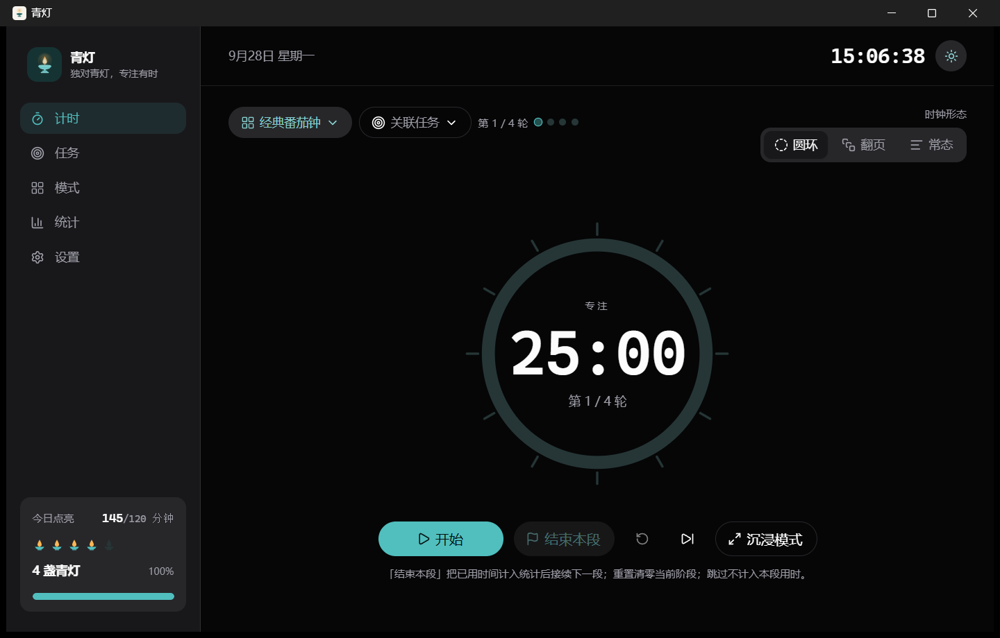

# 青灯

> 独对青灯，专注有时

一个安静的专注计时工具，帮你把「该干活了」变成一件有始有终的事：选好时长，点开始，剩下的交给它——专注与休息首尾相接，不用反复点开始；记录自动攒下来，看得出这些时间花在了哪里。

不需要注册，不联网同步，所有记录只存在你自己的设备上。

<!-- 建议放 1–2 张截图，放在这里效果最好，GitHub 会显示在介绍之后：
     
     截图可以存在 docs/images/ 下 -->

## 它能做什么

| 你想要的 | 青灯怎么做 |
| --- | --- |
| 标准的番茄钟节奏 | 内置经典番茄钟：25 分钟专注 + 5 分钟休息，4 轮后长休 15 分钟 |
| 一次坐下来干很久 | 深度专注（50 / 10）、学习休息（45 / 15），也可以按自己的节奏自建模板 |
| 模拟考试或限时任务 | 考试模式：单段倒计时、不插休息、结束即停，剩余时间与预计结束时刻一起显示 |
| 只想记录投入了多久 | 正计时：只累计时间、手动结束，适合「从几点学到几点」这种记录 |
| 知道时间花在哪 | 任务清单 + 统计：今日 / 区间 / 完成段数 / 平均时长，配三种图表 |
| 不被打扰 | 沉浸模式（自动全屏、顶部常驻当前时间）、阶段结束提示音、Windows 免打扰 |
| 三种看时间的方式 | 圆环、翻页、常态倒计时，随时切换 |
| 数据自己拿着 | 一键导出 JSON 备份与 CSV 记录表（Excel 直接打开不乱码） |

## 下载与安装

到 [Releases](https://github.com/Soulmte/qingdeng/releases/latest) 下载最新版。

### Windows

下载 `QingDeng_<版本>_x64-setup.exe`，双击安装，装好后从开始菜单启动，图标名字是「青灯」。

- 支持 Windows 10 / 11（64 位），依赖系统自带的 WebView2（Win11 自带，Win10 一般也有）
- 有新版本会自动提示，并在弹窗里列出更新内容，确认后自动下载安装

### Android 平板

下载 `QingDeng_<版本>_arm64.apk`，传到平板后点开安装。

- 需要 Android 7.0 及以上，且是 arm64 设备（绝大多数现代平板都是）
- 首次安装时系统会拦一下，需要在提示里允许「安装未知来源的应用」
- 平板上的更新方式是下载新 APK 覆盖安装，没有应用内自动更新（系统不允许应用静默替换自己）

> 这个 APK 只包含 arm64 架构，装在电脑上的 Android 模拟器（通常是 x86_64）会提示不兼容。

## 上手三步

1. **选模板** —— 点计时页左上角的「模板与时长」
2. **定时长** —— 左栏挑模板，右栏是 5 / 10 / 15 / 25 / 45 / 60 / 90 分钟一键开始，也可以自己填时分秒
3. **点开始** —— 之后专注和休息会自己接下去，中途随时可以暂停

### 控制条上三个容易混的按钮

| 按钮 | 什么时候用 |
| --- | --- |
| 结束本段 | 这一段就到这儿。已用的时间照样计入统计，然后接续下一段 |
| 重置 | 刚才那段不算了，当前阶段从头重新计时 |
| 跳过 | 整段跳过，不计入本段用时，直接进入下一段 |

## 界面说明

| 页面 | 做什么 |
| --- | --- |
| 计时 | 主界面：时钟、控制条、当前模板、关联的任务 |
| 任务 | 建任务、填预估段数；关联到计时后，完成的专注段会自动累加到进度里 |
| 模式 | 管理模板（内置 5 个 + 自建的），切换当前用哪一个 |
| 统计 | 今日 / 区间 / 完成段数 / 平均时长，配每日时长柱状图、完成段数折线图、模板占比环形图 |
| 设置 | 亮暗主题、时钟形态、每日目标、自动接续、提示音、免打扰、沉浸模式、导出与清空数据、检查更新 |

## 计时是怎么走的

- 专注结束后按「短休息 → 专注 → … → 长休息」推进，长休息出现在每 N 轮专注之后（N 由模板决定）。
- 阶段结束默认**自动开始下一段**，不用每轮重新点开始；想每段都手动开始，就在设置里关掉「自动接续下一段」。
- 休息时间配成 0 分钟表示这个模板不排休息，轮次就变成「连续做完几段就结束」。
- 计时按时间戳推算，窗口失焦、系统休眠恢复后都不会走偏。
- 太短的中断不留记录，免得误触把统计搅乱；「结束本段」是明确操作，门槛比误触宽松得多。
- 记录会带上当时的任务名，任务删掉之后也还能回溯。

## 快捷键

| 按键 | 作用 |
| --- | --- |
| 空格 | 开始 / 暂停（光标在输入框里时不会拦截） |
| Esc | 退出沉浸模式 |

触摸屏上轻点画面可以唤出控制栏。

## 常见问题

**我的数据存在哪？会被上传吗？**

只存在你自己的设备上。不联网、不上传、不需要账号。想备份或换设备，用设置页的「导出完整备份」；想要能直接看的表格，用「导出记录表」导成 CSV，Excel 打开不会乱码。

**为什么休息结束会自己开始下一段专注？**

这是默认开启的「自动接续」，目的是省掉每轮点一次开始。不想要就在设置里关掉，关闭后每段结束会停在待开始状态。

**我忘了点结束就关掉窗口，会怎样？**

时长按真实经过的时间算，窗口失焦或系统休眠恢复后都不会走偏；但没点「结束本段」、也没跑完整段的话，那一段不会留下记录。

**任务和记录是什么关系？**

记录可以关联到一个任务。完整跑完的专注段会自动累加到任务进度里；没关联任务的记录也照常计入统计，两者不冲突。

**统计里的「完成段数」和我数的不一样？**

只有完整跑完的专注段才算「完成」。「结束本段」提前收尾的那些，时间会计入时长统计，但不算完成段数——这样「我今天干净地做完了 6 段」才是个可信的数字。

**Android 上为什么没有自动更新？**

Android 不允许应用静默覆盖安装自己。新版本需要下载 APK 覆盖安装；因为新旧包用同一个签名，覆盖安装能平滑升级，数据也不会丢。

**换电脑了，记录能带走吗？**

可以导出 JSON 备份留档。目前应用内还没有导入功能（在待做清单里），临时查看可以用导出的 CSV 配合 Excel。

## 反馈

发现 bug、想要某个功能，或者有别的想法，欢迎到 [Issues](https://github.com/Soulmte/qingdeng/issues) 说一声。

## 开发者

构建、打包、Android 环境搭建、更新机制与发版流程见 [docs/DEVELOPMENT.md](docs/DEVELOPMENT.md)。
