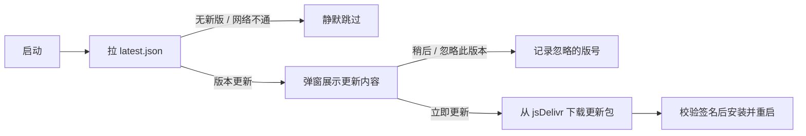

# 青灯开发文档

面向开发者：构建、打包、平台适配与应用内更新机制。
普通用户的使用说明、下载与常见问题请回到 [README](../README.md)。

界面不使用任何 emoji，图形元素由 lucide 图标、bklit 图表与手写 SVG/CSS 构成；
主题变量集中在 `src/index.css` 的 `:root` / `.dark`，未分层书写以高于 HeroUI 的 `layer(theme)`。

## 技术栈

| 层 | 选型 |
| --- | --- |
| 桌面容器 | Tauri 2（Rust 1.98） |
| 移动端 | Tauri 2 Android（同一前端产物，平台能力隔离见下） |
| 前端 | React 19 + TypeScript 6 + Vite 8 |
| UI 组件 | HeroUI v3（Tailwind CSS v4） |
| 图表 | bklit（shadcn registry，基于 visx） |
| 状态管理 | Zustand |
| 本地存储 | SQLite（`@tauri-apps/plugin-sql`） |
| 桌面能力 | 全屏与置顶（core window）、阻止休眠（`keepawake`）、系统通知、应用内更新（`tauri-plugin-updater`）、资源管理器定位（opener） |
| 移动能力 | 系统通知，其余桌面独有能力在 Android 上关闭 |
| 图标 | lucide-react |

## 运行

前置：Node 22+、Rust 1.80+、Windows WebView2（Win11 自带）。

```bash
npm install
npm run tauri dev      # 开发模式，前端 1420 端口由 CLI 自动拉起
npm run tauri build    # 打包安装程序，产物在 src-tauri/target/release/bundle
```

打包脚本默认用 `tauri.conf.json` 里的 `productName`（青灯）命名安装包，
所以产物是 `青灯_<版本>_x64-setup.exe`（NSIS），同时产出同名的 `.exe.sig` 供自动更新校验。

> `bundle.targets` 固定为 `nsis`。WiX 工具链（`light.exe`）处理不了中文产品名，
> 带上 `msi` 会直接构建失败；需要 MSI 的话得把产品名改回英文。

数据文件在首次启动时自动创建：

```
%APPDATA%\com.qingdeng.app\qingdeng.db
%APPDATA%\com.qingdeng.app\exports\        # 导出的备份与 CSV
```

建表由 `src-tauri/src/lib.rs` 里的 Migration 在应用启动时执行，字段说明见 `docs/schema.sql`。

## 目录结构

```
src/
├── App.tsx                     路由与启动时数据恢复
├── db/client.ts                SQLite 访问层，snake_case 只在这里出现
├── stores/
│   ├── timerStore.ts           计时状态机（阶段推进、入库、提示音与通知）
│   ├── taskStore.ts            任务清单与进度聚合
│   ├── settingsStore.ts        偏好设置，落到 settings 表
│   ├── presetStore.ts          自定义模板 CRUD
│   ├── immersiveStore.ts       沉浸模式状态 + 全屏副作用
│   ├── updateStore.ts          更新检查、下载进度与「忽略此版本」
│   └── dataStore.ts            记录版本号，驱动统计与任务进度刷新
├── lib/                        纯函数：时间格式化、预设规则、统计聚合、导出、通知、主题、提示音
│   ├── platform.ts             平台能力判断（窗口控制 / 免打扰 / 阻止休眠 / 应用内更新）
│   └── updater.ts              拉取 CDN 清单、比对版本、下载安装与重启
├── hooks/                      时钟数据换算、模板与任务管理流程、记录查询、窗口同步、快捷键
├── components/
│   ├── BrandMark.tsx           自绘的青灯标识（内联 SVG）
│   ├── UpdateDialog.tsx        启动时的新版本弹窗（版本号 + 更新内容 + 下载进度）
│   ├── clock/                  三种时钟形态 + 字号自适应表
│   ├── timer/                  控制条、模板与任务弹窗、快速开始、模板编辑
│   ├── task/                   任务行与任务编辑弹窗
│   ├── layout/                 侧边栏、主题切换、今日概览
│   ├── charts/                 bklit 图表组件（registry 生成，勿手改）
│   └── ui/                     自行封装的轻量控件（分段选择器、步进输入、弹层）
└── views/                      计时 / 任务 / 模式 / 统计 / 设置五个页面
```

## 开发辅助

没有图形界面时可以用结构检查脚本确认页面真的渲染出了关键元素：

```bash
npm run check:dom          # 结构：渲染成静态 HTML 后断言语义与关键元素
npm run check:interaction  # 交互：在 jsdom 里真的输入与点击，验证控件能改
```

`check:dom` 覆盖设置页、计时页、任务页、模板与任务弹窗、统计页、侧边栏，
逐项校验开关数量、圆环字号档位、步进控件、日期窗口、CSV 转义等结构，
渲染结果写到 `scripts/out-*.html` 供人工查看。

`check:interaction` 用 jsdom 真实渲染模板编辑弹窗与更新弹窗，模拟输入两位数、点击加减按钮、
点击常用时长与「不排休息」，验证状态与摘要确实联动；
另有一组直接驱动计时状态机的断言：默认自动接续、
结束本段会落库并接续下一段、关掉自动接续后停在原地、跳过不计入不足 30 秒的片段。
（jsdom 缺少的 `PointerEvent` / `InputEvent` / `CSS` 等在 `scripts/dom-setup.ts` 里补齐；
弹层用 `createPortal` 挂到 body，断言需从 `document.body` 查。
注意 zustand 在静态渲染下读的是初始状态，所以依赖运行时状态的弹窗只能在 jsdom 里验证。）

验证 Windows 专注助手接口是否可用（只读，不会改动系统免打扰状态）：

```bash
cd src-tauri && cargo run --example focus_probe
```

README 里的界面截图由脚本生成，界面改动后可以重新跑一遍：

```powershell
# 先把应用打开，脚本会把窗口固定尺寸并依次点开五个页面截图
powershell -ExecutionPolicy Bypass -File scripts\capture-window.ps1
```

两个踩过的坑写在脚本注释里：WebView2 是硬件合成渲染，普通 BitBlt 只能截到黑屏，
必须用 `PrintWindow` 加 `PW_RENDERFULLCONTENT`；另外 PowerShell 默认不是 DPI 感知的，
不先调 `SetProcessDPIAware` 会导致点击坐标被系统缩放一次，表现为“点偏一项 + 图被裁”。

## 安卓与手机

同一份前端产物同时跑在 Windows 桌面、安卓平板与手机上，平台差异集中到 `src/lib/platform.ts` 一处判断，组件只问「有没有这个能力」，不自己判断平台。

### 导航形态：先看指针，再看宽度

导航形态由**指针类型**和**可用宽度**两个轴决定，实现全在 `src/index.css` 的 `.nav-*` 一族类里：

| | < 768px | ≥ 768px | ≥ 1024px |
| --- | --- | --- | --- |
| 触屏 | 底部导航 | 左侧图标栏 84px | 左侧图标栏 84px |
| 鼠标 | 底部导航 | 左侧图标栏 84px | 完整侧边栏 224px |

关键一条：**触屏设备永远用不到 224px 的桌面侧边栏**。安卓平板横屏普遍在 1280px 以上，只按宽度判断会直接落到桌面布局，整页看上去就是一套后台管理系统——最初的“平板做得不好”就是这么来的。

- `platform.ts` 的 `applyLayoutClass()` 在首屏渲染前把 `touch-ui` 挂到 `<html>` 上，CSS 靠 `html:not(.touch-ui)` 守卫侧边栏。选在渲染前挂是为了不先闪一下侧边栏。
- 触屏的判定是「安卓 **或** 主指针为 coarse」：平板上插了鼠标、或者用 S Pen 时 `pointer` 会变成 fine，但那仍然是一块用手点的屏幕。
- 图标栏只有图标，不做“图标 + 文字”两行；触控目标 48px。底栏因为占一整条，才带文字。
- 形态切换全部靠 CSS，不靠 JS 测量宽度，所以 SSR 出来的同一份标记在任意宽度下都是对的。

### 各页面的手机适配

- 顶栏：手机上只留品牌标记、当前时间与主题按钮；今日进度移到顶栏下面一条细带（`TodaySummary variant="strip"`）。平板与窄窗口的顶栏用胶囊版（`compact`），宽屏桌面则只有侧边栏里那张完整卡片。
- 计时页：标题栏折成两行，模板与任务按钮平分宽度，时钟形态在窄屏只留图标。控制条拆成「主操作 / 次要操作」两组，窄屏上下排列，宽屏自动并成一行；沉浸模式在窄屏收成一个图标。
- 统计页：最近记录在窄屏换成卡片列表，六个列的表格在手机上读不了；柱状图给 200px 最小高度，`aspectRatio` 在手机上只剩不到 40px 高，柱子和 Y 轴标签会叠在一起。
- 任务页：添加栏竖排，添加按钮占满宽度；每行的四个操作按钮在窄屏排成两列。
- 设置页：`SettingRow` 在窄屏改为上下排列，控件单独一行；导出与更新那几个按钮在窄屏占满宽度。
- 弹层：`Dialog` 在手机竖屏贴底展开（圆角只留上方、加一条提示条、留出安全区），宽屏回到居中卡片。铺满那一条写在 index.css 的 `.dialog-sheet` 里，因为要用未分层规则才能稳定盖住同宽的 `max-w-*` 工具类。

### 时钟字号按容器比例，不按窗口

三种时钟的文字都用 `cqw`（容器宽度的百分比），容器挂 `.clock-box` 声明 `container-type: inline-size`。

以前是按窗口宽度挑 `text-5xl` / `text-7xl` 这类固定字号，每个档位都是人肉试出来的，容器一变窄（手机竖屏、手机横屏）字就会顶出圆环。改成比例之后 320px 的手机和 4K 显示器共用同一套比例，不必再为每种屏幕补档位。圆环容器另外给了 `min-w-[180px]`，因为手机横屏视口很矮，只按 `vh` 算会挤成一个读不出数字的小圆圈。

### 设备预览工具

改完移动端布局要看真实效果，可以用这个脚本按设备尺寸截图：

```bash
python scripts/device-preview/shots.py              # 手机 / 平板 / 桌面几张对照图
python scripts/device-preview/shots.py phone-pages  # 只截其中一组
python scripts/device-preview/site-shots.py         # 下载页（长页分段截）
python scripts/device-preview/screenshots.py        # 重生 README 与下载页的全套截图
```

两个坑它都已经绕过了：

1. **Chromium 在 Windows 上有最小窗口宽度（约 496px）**，`--window-size=390,844` 会被夹到 496，手机视口根本设不进去。脚本把真正的布局放进 iframe：iframe 的视口就是它的 CSS 尺寸，与外层窗口无关。
2. **zustand 在 SSR 下读的是初始状态**（`useSyncExternalStore` 的服务端快照取 `getInitialState`），所以 `renderToStaticMarkup` 出来的页面永远是空数据。脚本改成在浏览器里挂载，并用一个假数据库（`scripts/device-preview/tauri-stub.ts` 里的 `select` 按 SQL 文本返回演示数据）喂进真实结构的数据。

产物在 `scripts/device-preview/out/`，中间文件都已 gitignore。

下载页那几张图要成套（同一份演示数据与主题），散着更新会变得风格不一致，
所以取图与裁切都收在 `screenshots.py` 里：

- 桌面六个页面写进 `docs/images/`，README 直接引用；
- 同一批里再写一份到 `site/img/`：整窗口、手机、以及从整图上裁出来的三张细节特写（表盘、任务进度条、柱状图）。

### 平台能力差异

| 能力 | Windows 桌面 | Android 平板 |
| --- | --- | --- |
| 全屏 / 窗口置顶 | 支持 | 不提供，设置页隐藏对应行 |
| 阻止屏幕休眠 | `keepawake` | 无该 crate 实现，命令返回成功但不生效 |
| 系统免打扰 | Windows 11 专注助手 | 不提供，整块设置卡片隐藏 |
| 导出后定位文件 | 资源管理器 | 不提供 |
| 三种时钟 / 模板 / 任务 / 统计 / 导出 | 支持 | 相同 |

导出目录在 Android 上是应用私有目录 `/data/data/com.qingdeng.app/files/exports`，设置页会按平台换文案。

### 本地环境

工具链与项目代码分开放，重装项目或清 `target` 都不会动到几个 GB 的 SDK：

| 项 | 位置 |
| --- | --- |
| JDK | `D:\enviroment\jdk-21.0.1\jdk-21.0.1`（已设 `JAVA_HOME`） |
| Android SDK | `D:\enviroment\android-sdk`（已设 `ANDROID_HOME` / `ANDROID_SDK_ROOT`） |
| Android NDK | `D:\enviroment\android-sdk\ndk\27.0.12077973`（已设 `NDK_HOME`） |
| 发布密钥库 | `%USERPROFILE%\.tauri\qingdeng-android.keystore`（不进仓库） |

SDK 里已装：`cmdline-tools;latest`、`platform-tools`、`platforms;android-37.0`、`build-tools;37.0.0`、`ndk;27.0.12077973`。
注意 Android 现在用次版本号命名平台包，所以是 `android-37.0` 而不是 `android-37`。

环境变量由一个脚本写入（可重复执行，不会重复追加 PATH）：

```powershell
powershell -ExecutionPolicy Bypass -File scripts\setup-android-env.ps1
```

### Windows 上必须先开开发者模式

`tauri android build` 不会把 Rust 产出的 `.so` 拷进 `jniLibs`，而是建一个符号链接；
Windows 只有在开发者模式打开时才允许普通进程建链接，否则报：

```
failed to create a symbolic link ... Creation symbolic link is not allowed for this system
```

开启需要管理员权限，所以单独拆了一个脚本（会弹 UAC）：

```powershell
powershell -Command "Start-Process powershell -Verb RunAs -ArgumentList '-ExecutionPolicy','Bypass','-File','scripts\enable-dev-mode.ps1'"
```

### 构建

```bash
rustup target add aarch64-linux-android armv7-linux-androideabi i686-linux-android x86_64-linux-android
npm run tauri android init      # 生成 src-tauri/gen/android 工程（已提交，重跑不会覆盖 Gradle 修改）
npm run tauri android dev       # 连上平板真机或模拟器调试
npm run tauri android build -- --apk --target aarch64   # 只出 arm64 的 APK，快得多
npm run tauri android build -- --apk                    # 四种 ABI 都打，体积大、编译久
```

产物在 `src-tauri/gen/android/app/build/outputs/apk/universal/release/app-universal-release.apk`。

### 签名

Android 不装未签名的 APK，所以发布包必须签名。签名材料有两处，都不会进仓库：

- 密钥库：`%USERPROFILE%\.tauri\qingdeng-android.keystore`
- 配置：`src-tauri/gen/android/keystore.properties`（写库路径、别名与口令）

`app/build.gradle.kts` 里有签名配置：有 `keystore.properties` 就用它，
没有就退回读 `ANDROID_KEYSTORE_PATH` 等环境变量（CI 用），两者都没有则产出未签名 APK。
空字符串也会当成未配置，避免 CI 传了空 secret 就拼出一个非法路径。

校验签名：

```bash
"$ANDROID_HOME/build-tools/37.0.0/apksigner.bat" verify --print-certs <apk>
```

安装后桌面上的名字取自 `tauri.conf.json` 的 `productName`，现在是「青灯」，
所以 Windows 安装包是 `青灯_<版本>_x64-setup.exe`。应用内部标识仍是 `com.qingdeng.app`，
改显示名不会动到数据目录，已有的记录不会丢。

### 图标

源文件都在 `src-tauri/icons/`：

| 文件 | 用途 |
| --- | --- |
| `app-icon.svg` | 桌面端（`.ico` / `.icns` / PNG） |
| `app-icon-foreground.svg` | 安卓自适应图标的前景：透明底，只画那盏灯 |
| `app-icon.json` | manifest：指定上面两个文件和背景色 |

改完图标重新生成：

```bash
npm run tauri icon -- src-tauri/icons/app-icon.json
```

三个容易站人的地方：

- `tauri icon` 直接改写 `src-tauri/gen/android` 里的资源，**不写** `src-tauri/icons/android/`。
  后者是早期生成的一份副本，两个目录都提交了，改完要手动对齐一份，
  不然看那份旧副本会得出「背景色没生效」这种错误结论。
- 安卓桌面图标必须是自适应图标：`mipmap-anydpi-v26/ic_launcher.xml` 引用前景图与背景色，
  背景色来自 `values/ic_launcher_background.xml`。这两个文件由 `tauri icon` 生成，
  早期版本漏掉了任何一项，系统就会回退到旧式 `ic_launcher.png`——
  如果那张 PNG 还是模板图，桌面上就是那个默认图标。
- `values/ic_launcher_background.xml` 每次重跑 `tauri icon` 都会被改写，
  所以不要往生成物里写注释，要改背景色就改 `app-icon.json` 的 `bg_color`。

`npm run tauri android init` 不会覆掉已有的图标资源（实测哈希不变），
所以 CI 里那一步 `android init` 不会把图标打回模板图标。

`Cargo.toml` 里 `keepawake`、`windows`、`tauri-plugin-updater`、`tauri-plugin-process`
四个依赖都按目标平台分区引入，Android 上不参与编译；
`src-tauri/src/lib.rs` 中桌面独有的状态与命令都有 `#[cfg]` 守卫，Android 走 no-op 分支。
`vite.config.ts` 已按 Tauri 约定读取 `TAURI_DEV_HOST`，真机调试时前端会监听局域网地址。

## 应用内更新（jsDelivr + GitHub Releases）

更新走「静态清单 + 签名校验」：应用启动时拉一份 `latest.json`，版本号比本地新就弹窗，
把清单里的 `notes` 当作「更新内容」展示，用户确认后下载更新包、校验签名、安装并重启。



### 更新说明的格式

`docs/release-notes/<版本>.md` 同时管两个地方：GitHub Release 的正文，
以及弹窗里的「更新内容」——后者是把 `notes` 字段原样拿过来按行渲染的，
所以写 Markdown 标题不会出错，`parseNotes()` 会拆好：

| 写法 | 弹窗里的效果 |
| --- | --- |
| `# 标题` | 丢掉（和弹窗自己的标题重复） |
| `## 小节` | 当小节标题，去井号后加粗展示 |
| `- 条目` | 列表项，前面一个主色圆点 |
| 其他行 | 普通段落 |

没写说明文件时流水线会自动用上一个标签以来的提交记录，所以弹窗里一定有内容。

### 两个通道，各管一件事

GitHub 在国内直连慢，所以把「清单」和「下载」拆开走两条路：

| 内容 | 主通道 | 备通道 | 大小 |
| --- | --- | --- | --- |
| `latest.json` 清单 | jsDelivr（发版后自动刷新缓存） | GitHub Releases | 2 KB |
| 更新包 | jsDelivr（文件名带版本号 → 永久缓存） | — | 3.3 MB |
| 手动安装包 `.exe` / APK | GitHub Releases（APK 另镜像一份到 jsDelivr） | — | 3.2 / 8.4 MB |

清单很小，就算走 GitHub 也就几十毫秒，所以它主要是「拿得准」；真正慢的是几 MB 的更新包，
所以更新包的地址直接写成 jsDelivr，客户端下载就绕开了 GitHub。

```json
"endpoints": [
  "https://cdn.jsdelivr.net/gh/Soulmte/qingdeng@cdn/latest.json",
  "https://github.com/Soulmte/qingdeng/releases/latest/download/latest.json"
]
```

两个都在 `src-tauri/tauri.conf.json` 的 `plugins.updater.endpoints`。
注意 Tauri 的官方行为：**只有前一个地址返回非 2XX 才会试下一个**，连接超时不会自动回退，
所以 jsDelivr 放在第一位是为了国内能快速拿到清单。

### 为什么更新包是 `.nsis.zip` 而不是 `.exe`

jsDelivr 会直接 403 拦掉 `.exe`，实测结果：

| 扩展名 | 结果 |
| --- | --- |
| `.exe` | 403 Forbidden |
| `.nsis.zip` / `.zip` | 200 |
| `.apk` | 200 |
| `.json` / `.sig` | 200 |

所以 `bundle.createUpdaterArtifacts` 设为 `"v1Compatible"`，Tauri 会额外产出
`青灯_<版本>_x64-setup.nsis.zip` 作为 updater 包（updater 会自己解包再跑安装程序），
这个格式能上 jsDelivr。`.exe` 仍然照常产出，只是不参与自动更新。

> 需要注意：`v1Compatible` 是官方标注的迁移用格式，Tauri v3 会移除。
> 将来若要改用自建 CDN（下面一节），就应该把它改回 `true` 直接分发 `.exe`。

### 换成自己的 CDN

如果你有阿里云 OSS / 腾讯云 COS 这类国内对象存储，就可以彻底不走 jsDelivr：

1. 把 `createUpdaterArtifacts` 改回 `true`（直接分发 `.exe`）
2. 发版时 `npm run release:manifest -- --asset-base https://<你的域名>/qingdeng`
3. 把 `latest.json`、`青灯_<版本>_x64-setup.exe` 与其 `.sig` 传到这个目录
4. `tauri.conf.json` 的 `endpoints` 第一条换成你的 `latest.json` 地址

`--asset-base` 就是为这件事留的开关，其余逻辑都不用动。

### cdn 分支

仓库里的 `cdn` 分支不是代码分支，只放客户端要下载的文件：

```
cdn
├── latest.json                            # 清单（发版后 purge 缓存立即生效）
├── QingDeng_<版本>_x64-setup.nsis.zip     # updater 包
├── QingDeng_<版本>_x64-setup.nsis.zip.sig # 对应签名
└── QingDeng_<版本>_arm64.apk              # 平板手动下载
```

文件名必须和 `latest.json` 里的 `url` 逐字一致，否则 404。
每个版本的文件名都带版本号，所以旧版本用户去下载时也能命中各自的缓存。

写入这个分支的只有 `scripts/push-to-cdn.sh`。Windows 与 Android 两个作业是并行跑的，
都要往里放文件，所以脚本的规矩是「克隆（分支不存在就新建）→ 追加 → 重试推送」，
而不是强推一个孤分支。早先 Windows 作业用孤分支强推，把一个已经推上去的 APK
整个盖掉了——日志里两个作业都是绿的，分支上就是没有 APK，很难查。
现在两个作业都调这个脚本，谁先谁后都保得住对方的文件。
分支每次发版强推重建，所以它本身只有最新一版的文件。

> 实测踩到的一个坑：**同名文件重新发布时，jsDelivr 会继续发旧内容**。
> 正常发版因为文件名带版本号不会撞上；但如果手动重传了同一个文件名（比如修图后重打同一个版本的 APK），
> 必须刷一次缓存才会生效，而且刷完要等几十秒才全量生效：
>
> ```bash
> curl "https://purge.jsdelivr.net/gh/Soulmte/qingdeng@cdn/<文件名>"
> ```

### 签名密钥

updater 只接受签名过的包，所以发版必须有私钥：

- 私钥（**不要进仓库**）：`%USERPROFILE%\.tauri\qingdeng.key`
- 公钥（已写入配置）：`%USERPROFILE%\.tauri\qingdeng.key.pub`

私钥丢了就无法再发布更新，只能提醒用户重新下载安装。
换公钥等于换密钥对，老版本将无法验证新包。

### 自动发布（推荐）

`.github/workflows/release.yml` 已经把整条链路接好了，推一个 `v*` 标签就自动完成：
打包 → 签名 → 生成 `latest.json` → **校验签名与更新包配对** → 建 Release → 同步 `cdn` 分支 → 刷新 jsDelivr 缓存。
客户端下次启动就能看到更新弹窗。

那道校验是发布前的闸门：updater 只认签名，一旦清单里的 `signature` 与上传的文件对不上
（换错文件、传了旧 `.sig`、改了资产名却没改 `url`），用户会「下载成功但更新无反应」，
而且只有真正发出去才会暴露，所以宁可让流水线在这一步失败。本地可以单独跑：

```bash
npm run release:verify        # 自动在 bundle 目录里按签名反查配对的文件
```

```bash
# 1. 三处版本号一起改：package.json、src-tauri/tauri.conf.json、src-tauri/Cargo.toml
# 2. 想要中文更新说明就写 docs/release-notes/<版本>.md，不写则自动用上一个标签以来的提交记录
# 3. 提交后打标签推送
git commit -am "Bump version to 0.2.0"
git tag v0.2.0
git push origin main --tags
```

流水线需要两个仓库 Secret（Settings → Secrets and variables → Actions）：

| Secret | 值 |
| --- | --- |
| `TAURI_SIGNING_PRIVATE_KEY` | `%USERPROFILE%\.tauri\qingdeng.key` 文件里的完整内容 |
| `TAURI_SIGNING_PRIVATE_KEY_PASSWORD` | 生成密钥时设的口令；生成时留空就也留空 |
| `ANDROID_KEYSTORE_BASE64` | 密钥库 base64 后的内容（见下） |
| `ANDROID_KEYSTORE_PASSWORD` | 密钥库口令 |
| `ANDROID_KEY_ALIAS` | 密钥别名，当前是 `qingdeng` |
| `ANDROID_KEY_PASSWORD` | 密钥口令 |

少了 `TAURI_SIGNING_PRIVATE_KEY` 流水线会直接失败，而不是发出去一个 updater 不认的包。
Android 那四项同理：没配置就报错退出，而不是发一个装不上的未签名 APK。

也可以在 Actions 页面手动触发，并在 `only` 里选 `windows` / `android` 只跑一个平台：
修完 Android 作业不必把 Windows 重新构建一遍。

```bash
curl -X POST -H "Authorization: Bearer <token>" \
  https://api.github.com/repos/Soulmte/qingdeng/actions/workflows/release.yml/dispatches \
  -d '{"ref":"main","inputs":{"only":"android"}}'
```

Android 作业用 runner 自带的 SDK，自己装 `platforms;android-37.0`、`build-tools;37.0.0`
与 `ndk;27.0.12077973`。别换回 `android-actions/setup-android`：
它会去装已经下架的 `tools` 包，实测报 `Failed to find package 'tools'` 后直接失败。
另外这两个脚本里所有管道都处在 `set -o pipefail` 下，
`yes | sdkmanager` 或 `cmd | head` 这类写法会因为上游吃到 SIGPIPE 把整步判成失败，
已经踩过两次。

密钥库是二进制，只能 base64 后放进 Secret：

```bash
base64 -w0 "%USERPROFILE%/.tauri/qingdeng-android.keystore" > keystore.b64   # 或 certutil -encode
```

Android 作业跟在 Windows 之后，把 APK 挂到同一个 Release。它不参与自动更新，
只作为下载入口（平板上更新靠下载 APK 覆盖安装）；即使 Android 作业失败，
Windows 用户的更新链路也不受影响。

### 手动发布

本地发一版（排查流水线问题时用）：

```bash
set TAURI_SIGNING_PRIVATE_KEY=%USERPROFILE%\.tauri\qingdeng.key
npm run tauri build
npm run release:manifest -- --notes-file docs/release-notes/0.2.0.md
```

脚本会打印需要上传的文件清单与目标名；文件名必须逐字照做，因为 `latest.json` 里的 `url`
已经按那些名字写好。它会先检查签名是否存在、更新内容是否为空，缺任何一样都直接报错退出。

需要上传两处：

- `cdn` 分支：`latest.json` + 更新包与它的 `.sig`（客户端从这里下载）
- 对应的 Release：手动安装包 `.exe`（供人工下载），可选带上更新包与清单

传完 `cdn` 分支后记得刷一次 jsDelivr 缓存，否则清单最多要等 12 小时：

```bash
curl "https://purge.jsdelivr.net/gh/Soulmte/qingdeng@cdn/latest.json"
```

### 本地试跑

把 `endpoints` 临时改成 `http://localhost:8788/latest.json`，
在 `release/` 下起一个静态服务器（`npx serve release`），
把 `release/latest.json` 的 `version` 改成本地更高的值，重新打开应用就能看到弹窗；
改回小于等于本地版本即可关闭。

### Android 的差异

Android 不允许应用静默覆盖安装自己，所以 `updater` 插件只在桌面端注册，
Capability 也在 `src-tauri/capabilities/updater.json` 里用 `platforms` 限定为 `windows / macOS / linux`。
平板上更新靠下载 APK 覆盖安装：APK 会同时挂到 Release 和 `cdn` 分支（jsDelivr 是放行 `.apk` 的）。

注意 APK 不像 Windows 更新包那样有应用内签名校验（签名由 Android 系统在安装时把关，
所以覆盖已装应用是安全的，但首次安装时请优先用 Release 里的那份）。

## 日期倒计时

与专注计时完全独立：一个在陪你度过这段时间，一个在替你看还有多久到那个日子。

```
countdowns
├── title              # 名称，例如考研
├── target_at          # ISO 时间戳，时刻精确到分钟
├── show_in_immersive  # 是否在沉浸模式里一并显示
└── created_at
```

表由第二个 Migration 建（`add_countdowns`），已有的库升级时只跑这一条。

### 三个容易写错的地方

1. **不能用 `new Date("2026-12-26")` 解析日期输入**。那个写法按 UTC 解析，东八区会变成前一天早上 8 点，倒计时整整差一天。`fromDateTimeInput()` 把日期与时刻拆成数字后按本地时间逐段构造，并校验没有溢出（2 月 30 日会被 `Date` 顺延到下个月，这里挡掉）。
2. **`<input type="date">` 与 `<input type="time">` 用原生控件**。安卓上会直接唤起系统选择器，比自造日历对手机友好得多，也天然满足「精确到分钟」；样式用 `--field-*` 变量对齐 HeroUI 的输入框。
3. **天数要按日历天算，不要拿两个时刻做差**。差值算法下目标设成 08:30 的话，每天的 08:30 数字就会跳一次，同一个日子的下午和晚上显示的天数还不一样。`countdownParts()` 先把两边归到当天零点再做差，天数才稳定。

### 显示约定

- **天数按日历天算，零点翻页**：中间隔几个零点就是几天。这样「还有 128 天」一整天都是 128，过零点才减一；同一个日子的早上和晚上看到的数字一样。
- 一天以上只报天数；到了目标这一天，改成报到小时与分钟（`formatRemaining()` 与卡片上那个大数字用同一套口径）。
- 目标时刻精确到分钟，决定的是这一天里从什么时候算「到了」。默认给到当天 23:59，也就是「整天都算还没到」；设成 08:30 就会在那天早上 8 点半落到 0。
- 已经过去的日子沉到列表最后并置灰（`opacity-60`），不自动删。
- 沉浸模式里它们是安静的一行字，**不跟着控制栏一起淡出**：那是信息，不是控件。

## 下载页（GitHub Pages）

`site/` 是一份手写的静态下载页，没有构建步骤，整个目录直接发到 GitHub Pages：

```
site/
├── index.html    # 页面结构与文案
├── styles.css    # 全部样式（配色与 src/index.css 同一套，改主色两边都要改）
├── app.js        # 读 latest.json，把按钮指到具体文件并排出更新记录
└── img/          # 截图与站点图标
```

页面打开后会去 jsDelivr 拉 `latest.json`，拿到版号后把两个按钮指向：

| 平台 | 地址 | 原因 |
| --- | --- | --- |
| Windows | GitHub Releases 直链 | jsDelivr 拦 `.exe`，没别的选择；直连慢也只能等 |
| Android | jsDelivr 上的 APK | 平板多半在国内网络，走 CDN 快很多 |

按钮的初始 `href` 指向发布页，所以 CDN 拉不到清单时页面依然能用。
更新记录直接复用清单里的 `notes`，排法与 `src/lib/updater.ts` 的 `parseNotes()` 一致（一级标题丢掉，二级标题当小节，`- ` 当条目）。

部署：`.github/workflows/pages.yml`，只在 `site/**` 变化时跑。

> 第一次部署前必须先开启 Pages，而且 `build_type` 要选 `workflow`。
> 工作流里虽然给 `configure-pages` 传了 `enablement: true`，实测在仓库从未开过 Pages 时它还是失败，
> 所以一开始就手动建了一次：
>
> ```bash
> curl -X POST -H "Authorization: Bearer <token>" -H "Accept: application/vnd.github+json" \
>   -d '{"build_type":"workflow"}' https://api.github.com/repos/Soulmte/qingdeng/pages
> ```
>
> 开好之后工作流里的 `configure-pages` 就能跑通了。

查流水线状态（发布作业与下载页部署）用 `scripts/ci-check.py`，凭据从本机 git 凭据管理器取：

```bash
python scripts/ci-check.py runs            # 最近几次流水线
python scripts/ci-check.py jobs <id>       # 某次流水线的每一步
python scripts/ci-check.py release 0.3.0   # 某版的发布资产
python scripts/ci-check.py dispatch pages.yml   # 手动重跑下载页部署
```

改完页面想先看一眼：

```bash
python scripts/device-preview/site-shots.py
```

页面很长，脚本用 iframe 向上位移分段截，每段都保持原始缩放。

## 需求与实现对照

| 需求 | 实现 |
| --- | --- |
| 亮暗场景切换 | HeroUI 主题体系（`.dark` + `data-theme`），首屏渲染前同步主题类避免闪白；设置页可选跟随系统 |
| 时钟多形态 | 圆环钟（SVG 进度环 + 60 格刻度 + 表壳发丝线 + 弧头光点）、翻页钟（CSS 3D 折叠动画）、常态倒计时（大字号 + 细进度条），可随时切换 |
| 圆环自适应 | 圆环最大边长 520px（沉浸模式 760px）并按视口高度收缩；时间字号按位数分三档，`10:00:00` 这类长时长不会溢出圆环 |
| 正倒计时 | 倒计时按阶段推进并自动排休息；正计时只累计投入时间，手动结束 |
| 预设模板 | 内置经典番茄钟、深度专注、学习休息、考试模式、正计时五种模板，支持新建 / 编辑 / 删除 / 复制自定义模板 |
| 模板入口 | 计时页顶部的「模板与时长」按钮打开弹窗，左栏切换与管理模板，右栏是系统预设时长与自定义单次计时 |
| 系统预设时间 | 5 / 10 / 15 / 25 / 45 / 60 / 90 分钟一键开始，不计入模板列表 |
| 自定义单次时间 | 分秒自由输入（带加减按钮），可选正倒计时，只对本次生效 |
| 考试模式 | 单段倒计时、不插入休息、结束即停；剩余时间与预计结束时刻同时展示 |
| 学习休息模式 | 45 分钟学习 + 15 分钟休息自动接续，每 2 轮进入 30 分钟长休息 |
| 任务清单 | 任务含标题、备注、预估段数；关联到计时后，完成的专注段自动累加到任务进度，可设为「当前任务」、完成 / 恢复 / 删除 |
| 沉浸模式 | 自动全屏、隐藏导航与设置项，顶部常驻当前时间与日期，鼠标静止 3 秒后自动隐藏操作栏；当前时间是否常驻可开关 |
| 提醒 | 阶段结束播放 Web Audio 合成提示音；应用不在前台时额外发送系统通知；专注段恰好补满任务的预估段数时单独提醒一次 |
| 专注免打扰 | 计时期间可调用 Windows 11 专注助手静音其他应用通知（`FocusSessionManager`），并提供本应用提醒白名单；一键跳转系统通知设置（免打扰是系统级能力，应用无法代替用户维护优先应用名单） |
| 统计 | 今日 / 区间 / 完成段数 / 平均时长四个指标，含每日时长柱状图、每日完成段数折线图、模板占比环形图；图表左侧给出数值轴，模板占比图例带分钟数与百分比并与环形图悬停联动 |
| 日期窗口 | 统计区间最多回溯 N 天，但从第一条记录那天开始截断，避免刚使用时出现一长串空白日期 |
| 数据导出 | 一键导出完整备份（JSON）或记录表（CSV，带 BOM，Excel 直接打开不乱码），导出后自动在资源管理器中定位文件 |
| 自动接续 | 专注与休息首尾相接，阶段结束自动开始下一段，不用每轮重新点开始；可在设置里关掉，改成每段手动开始 |
| 手动结束本段 | 不必等整轮跑完，随时按「结束本段」把已用时间计入统计再接续下一段；另有「重置」清零当前阶段、「跳过」不计入本段用时 |
| 应用内更新 | 启动时拉取 `latest.json`，有新版本弹窗列出更新内容，确认后下载、签名校验、安装并自动重启；下载中显示已下载 / 总大小、百分比与实时速度（两次采样加指数平滑），拿不到总大小时退化成不确定进度条；更新包走 jsDelivr，国内下载不用直连 GitHub；设置页可手动检查或忽略某版本 |
| 下载页 | `site/` 发布到 GitHub Pages，打开时读清单把 Windows 与 Android 的按钮指向具体安装包，并把更新记录排出来；安卓版的设置页入口指向这里 |
| 数字输入 | 全部用带加减按钮的步进控件；时长按时 / 分 / 秒三段输入（1 小时 30 分不用自己换算成分钟）；步长取 5 且 `min` 与 `step` 对齐（如每日目标 5 + n×5），避免输入 120 被吸附成 115 |
| 模板编辑 | 先用「排休息 / 不排休息」两个按钮定下模式，再填具体时长，底部实时生成一句「运行效果」描述 |
| 界面细节 | 统一的自定义滚动条（随主题换色）、字段边框与暗色填充、全站步进式数字输入、自绘的青灯标识 |
| 设备适配 | 同一套页面在桌面、安卓平板与手机上按「指针类型 + 宽度」切换导航：手机用底栏、平板与窄窗口用图标栏、鼠标宽屏才用完整侧边栏，触屏永远不用桌面侧边栏；各页面的标题栏、控制条、表格、设置行都按窄屏重排，弹层在手机上贴底展开 |

## 已知限制

- 阶段结束提示音为 Web Audio 合成的双音，没有提供自定义音频文件。
- 任务没有子任务、截止日期与手动排序。
- 手写弹层只实现了遮罩点击与 Esc 关闭，没有做完整的焦点循环。
- 导出只支持 JSON 备份与 CSV 记录表，暂不支持导入恢复。
- 更新只能向前，不做降级；CDN 清单拉不下来时静默跳过，不阻塞启动。
- 更新包没做差分，每次都是完整安装包。
- Android 版不支持应用内自动更新，只能下载 APK 覆盖安装。
